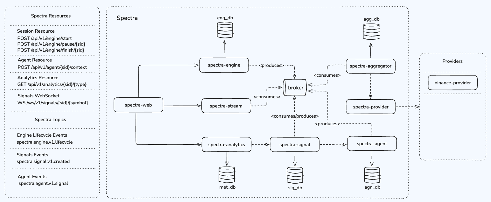

# Spectra

Spectra is a multi-module, distributed functional solution 
that generates real-time trading signals. It monitors price 
variance of user selected symbols over time and provides 
timely signals for trading decisions.


## Architecture

Spectra follows a multi-module, event-driven, with strict 
services boundaries and domain driven design (attempted). 
The overall architecture contains:
- 1 Kafka Broker
- 1 Frontend
- 7 Services + 1 Domain Module
- 5 Postgres DB's

As you can observe in the high-level exported services + contracts image:



### Topics

#### spectra.engine.v1.lifecycle

Spectra Engine service is responsible for managing the Session Lifecycle State, 
thus it has **producer** capabilities to communicate a new trading Session.

The **contract** is:

```jsonc
{
    "sid": "<sessionId>",
    "symbol": "<symId>",
    "window": [15, "Second"]
}
```

#### spectra.signal.v1.created

Spectra Signal service is responsible for the Session's Signals, thus
it also has **producer** capabilities by knwoing how to transform, persist,
and create trading Signals for specific symbols.

```jsonc
{
    "sid": "<sessionId>",
    "symbol": "<symbolId>",
    "next": [1, "Minute"],
    "call": "<Buy|Sell>",
    "sigId": "<signalId>",
}
````

#### spectra.agent.v1.signal

Spectra Agent service is responsible for managing the Session's Context,
through the AI providers running locally (TBI). It keeps the agent history
for metrics purposes and creates a new Context ID for each new Session started.
Thus, due to the event-driven async nature, once the Agent receives a 
trustful signal from the AI, the service produces a event:

```jsonc
{
    "sid": "<sessionId>",
    "symbol": "<symbolId>",
    "call": "<Buy|Sell>",
    "next": [1, "Minute", "Open"],
    "trust": 0.87,
    ...
}
```

### API's

Spectra has some entrypoints that lifts some capabilities to the UI.
As mentioned, Spectra has event-driven capabilities, so we treat each 
action as one independent action.

Some of them are:

### Engine Lifecycle API

#### POST /api/v1/engine/start/[sid]

Starts a new Session for a specific Symbol returning 201 created with
the Session ID.

```jsonc
{
    "sid": "<sessionId>"
}
```

#### POST /api/v1/engine/pause/[sid]

Pauses an existent session with 200 OK if a session exists or else
404 Not Found if the Session does not exists.

#### POST /api/v1/engine/finish/[sid]

Finishes an existent session with 200 OK if a session exists or else
also completes with 404 Not Found status.

### Web Socket

Spectra Stream service is responsible for exposing a single WebSocket
path.

#### WS /ws/v1/signals/[sid]/[symbol]

Through this WebSocket the interface can watch the latest 10 signals
generated by Spectra Intelligence.

The response is pretty similar to what Spectra Signal service produces,
in fact, Spectra Stream service consumes from the topics we covered before
**spectra.signal.v1.created** and cache in memory the latest 10 signals to 
be sent through the connection, as long it matches the cache keys.

Due to Haskell's Concurrence Safety we can achieve a real time model, pretty
easily with STM.

The output is:

```jsonc
{
    "sid": "<sessionId>",
    "symbol": "<symbolId>",
    "next": [1, "Minute"],
    "call": "<Buy|Sell>",
    "sigId": "<signalId>",
}
```

### FAQ

#### What Do I Need?

To start the application you will need [Docker](https://www.docker.com/), 
and Haskell toolchain, downloadable through [GHCUp](https://www.haskell.org/ghcup/install/),
I strongly recommend setting it up through it. 

#### How Do I Run?

Running in VSCode is pretty easily as **GHCUp** downloads
[Haskell Language Server](https://github.com/haskell/haskell-language-server) even though
[Haskell Extension](https://marketplace.visualstudio.com/items?itemName=haskell.haskell)
for VSCode will manage the versions based on [stack.yaml](./stack.yaml) resolver.

You should have in place a `.env` file with the following keys:

```.env
SPECTRA_AGN_DB_PASSWORD=<Agent DB Password>
SPECTRA_KAFK_CLUSTER_ID=<Kafka Cluster ID>
```

Once everything is in place, starting up is just a matter of running the 
[docker-run](./docker-run.sh) script which will remove any service running
then build and start the services, passing the env variables to the containers

> The script currently works for Unix systems, but you may do the same by 
> running it with docker compose directly, this script is just a facilitator

